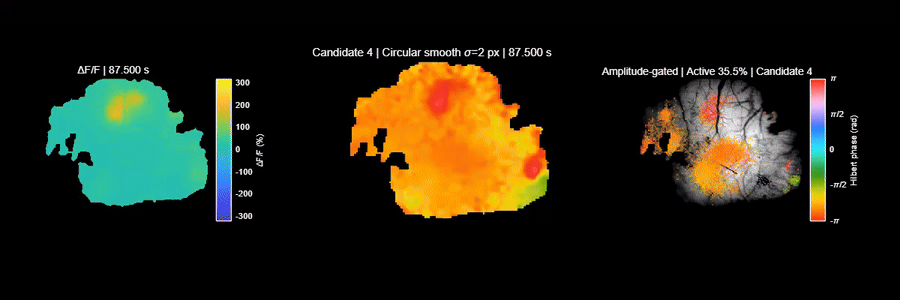

# CalWave

Reusable analysis functions for calcium-imaging recordings.

## Generate a RawCa movie

In MATLAB, add this folder to the path and pass either a MAT-file name or a
full path:

```matlab
projectDir = 'C:\path\to\Moodydataset';
addpath(fullfile(projectDir, 'CalWave'));

% A file name is searched for in Data/alldata and Data.
movieFile = make_RawCa_movie('12-11-17 Animal 1 Run 4 P8.mat');
```

By default, the function expects these variables:

- `RawCa`: height-by-width-by-time image stack
- `FrameRate`: positive scalar in Hz

The output is written to `Results/RawCa_movies` using the input file name.
The stack is read in chunks, so the complete recording is not loaded into
memory.

Useful options:

```matlab
movieFile = make_RawCa_movie(inputFile, ...
    'OutputFile', 'D:\movies\recording.mp4', ...
    'ChunkSize', 100, ...
    'LowPercentile', 1, ...
    'HighPercentile', 99.5, ...
    'Overwrite', true);
```

For another MAT-file schema, customize the variable names or provide the
frame rate directly:

```matlab
movieFile = make_RawCa_movie(inputFile, ...
    'RawCaVariable', 'images', ...
    'FrameRateVariable', 'fps');

% If the MAT file has no frame-rate variable:
movieFile = make_RawCa_movie(inputFile, 'FrameRate', 10);
```

Large MAT files must support partial reads; save them with MATLAB's `-v7.3`
option when creating them.

## Calculate DeltaF/F, movie, and PSD summaries

The combined pipeline uses the same dynamic-baseline definition as the
original scripts in `Code`: a per-pixel 10th-percentile baseline in 30-second
blocks, linearly interpolated over time.

```matlab
projectDir = 'C:\path\to\Moodydataset';
addpath(fullfile(projectDir, 'CalWave'));

results = make_dff_movie_and_psd('12-11-17 Animal 1 Run 4 P8.mat');
```

This creates five files in `Results/CalWave`:

- `<recording>_dff.mat`: uncorrected DeltaF/F stack and metadata
- `<recording>_dff_movie.mp4`: Raw fluorescence and DeltaF/F for the first 10 minutes
- `<recording>_dff_PSD.mat`: numerical PSD results
- `<recording>_dff_PSD_1x2.png`: Global PSD and 5-by-5 spatial-bin PSD distribution
- `<recording>_dff_PSD_1x2_log.png`: log-log version of the PSD plot

The PSD analysis uses the uncorrected 470-nm DeltaF/F signal. The first plot
shows the Welch PSD after averaging all cortical pixels over time. The second
shows the median, 25th percentile, and 75th percentile of the Welch PSD
calculated separately for every 5-by-5 spatial bin after averaging the
cortical pixels inside each bin. Hemisphere PSD is not calculated because
these recordings do not have left/right hemisphere labels.
For long recordings, PSD calculation is split into 15-minute time blocks by
default. The block PSDs are Welch-segment-weighted before the final summaries
are calculated.

For a custom cortical mask:

```matlab
results = make_dff_movie_and_psd(inputFile, ...
    'BrainMask', corticalMask, ...
    'AnalysisChunkSeconds', 900, ...
    'MovieDurationSeconds', 600, ...
    'SpatialBinSize', 5, ...
    'Overwrite', true);
```

## Run all sessions

The batch script is located in the `batch` subfolder:

```matlab
run('C:\path\to\Moodydataset\CalWave\batch\run_all_sessions_dff_psd.m');
```

It processes every MAT file in `Data/alldata`, skips complete sessions, and
recalculates incomplete sessions.

## GC#48 Day 7 candidate DF/F and phase movie

<video controls width="100%">
  <source src="./media/gc48_day7_track_0532_dff_phase_10x.mp4" type="video/mp4">
  Your browser does not support embedded video. [Download the MP4](./media/gc48_day7_track_0532_dff_phase_10x.mp4).
</video>

The video shows corrected DF/F on the left and the full-field 3–5 Hz
instantaneous phase map on the right. It uses 10× temporal interpolation and
is rendered at 30 fps, giving an effective playback rate of approximately 3 Hz.

This is an exploratory candidate from VG1-GC#48 Day 7 resting-state data:

- Candidate: CW track 532
- Recording time: approximately 138.4–139.5 s
- DF/F: 470 nm corrected using the 405 nm reference
- Phase: Ye-style full-resolution analytic phase, 3–5 Hz
- Note: this candidate is not a validated neuronal rotating wave

Direct file: [gc48_day7_track_0532_dff_phase_10x.mp4](./media/gc48_day7_track_0532_dff_phase_10x.mp4)

## Phase-map GIF



Direct file: [PhaseMap_1_5Hz_candidate04_20260820_225237.gif](./media/PhaseMap_1_5Hz_candidate04_20260820_225237.gif)
